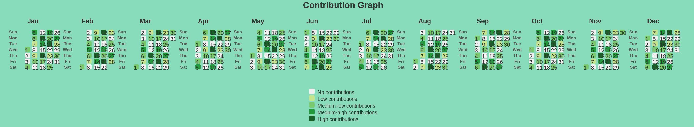
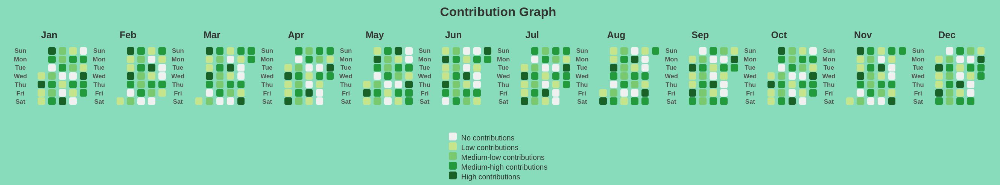

<h1 style="text-align: center;">ContributionGraph Component</h1>

 

The **ContributionGraph** component is an interactive graph that visualizes a user's daily contributions over the course of a year, displayed in a calendar format.

## Key Features

- **Calendar format display**: Each day is represented in a calendar layout, making it easy to track contributions over time.

 

- **Day coloring**: Each day is color-coded based on the number of contributions made on that day.

 

- **Tooltip**: When a user hovers over a day, a tooltip appears showing the exact date and the number of contributions made.

## Benefits

- **Easy tracking** of contributions over an extended period.

 

- **Dynamic interaction** through the tooltip, offering detailed information when needed.

## Example

 

